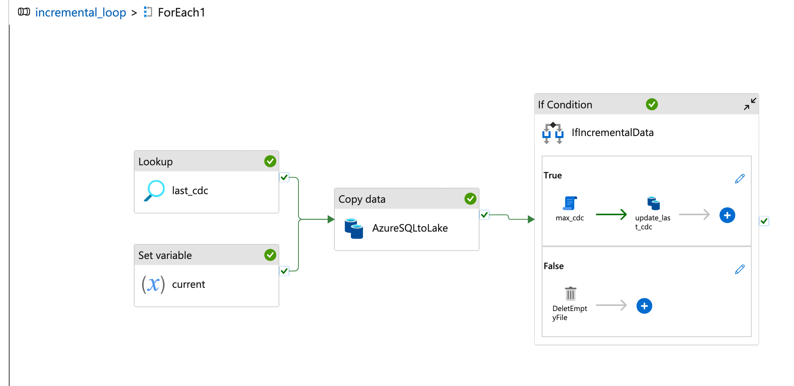

# **Azure Data Engineering Project**

### **Overview**  
This project demonstrates a full **Azure Data Engineering pipeline** using a modern **Medallion Architecture (Bronze → Silver → Gold)**.  
It showcases **incremental ingestion**, **streaming transformations**, **CDC/SCD processing**, **DLT pipelines**, and **production deployment** using **Databricks Asset Bundles**.

---

## Demo Video

[](https://youtu.be/KLdV9Xpsp9o)

# **Technologies Used**

| Layer | Tools / Services |
|------|------------------|
| **Ingestion** | Azure Data Factory, Watermark Incremental Loading |
| **Storage** | Azure Data Lake Storage Gen2 (ADLS) |
| **Compute** | Azure Databricks (PySpark, Delta Lake, AutoLoader) |
| **Metadata & Security** | Unity Catalog, Storage Credentials, External Locations |
| **Transformations** | PySpark, reusable transformation functions |
| **Gold Layer** | Delta Live Tables (DLT), SCD Type 2, CDC |
| **Orchestration** | Databricks LakeFlow Jobs |
| **Deployment** | Databricks Asset Bundles (DAB), GitHub |
| **Visualization** | Power BI (yet to do) |

# **Pipeline**


# **Layers Implemented**

### **🟤 Bronze Layer**
- Raw ingestion from SQL Server using ADF  
- Watermark column for incremental loads  
- Data stored in ADLS (Parquet)

### **⚪ Silver Layer**
- Cleaned and transformed datasets using PySpark  
- Implemented:
  - Schema evolution  
  - AutoLoader for incremental micro-batch processing  
  - Reusable transformation functions (`dropColumns`, etc.)  
- Data written as **Delta tables**

### **🟡 Gold Layer**
- Built using **Delta Live Tables (DLT)**  
- Implemented:
  - CDC (Change Data Capture)  
  - SCD Type 2 for history tracking  
  - Data quality expectations with `@dlt.expect_all_or_drop`  
  - Lineage tracking automatically handled by DLT  

---


## Snippets
**These snippets demonstrate key expressions and queries used in the pipeline**

### **1. Last CDC Dataset Property**
**Dataset folder for storing last CDC timestamp per table:**

```json
{
  "last_cdc_folder": "@{item().table}_cdc",
  "current": "@utcNow()"
}
```
**2. Copy Data Source Query**
**Select updated rows from source table based on CDC column:**
```sql
SELECT *
FROM @{item().schema}.@{item().table}
WHERE @{item().cdc_col} > '@{if(empty(item().from_date), activity('last_cdc').output.value[0].cdc, item().from_date)}';
```


### **3. Sink Folder Naming**
**Parameterized sink folder and table naming for incremental load:**

```json
{
  "sink_folder": "@concat(item().table, '_', variables('current'))",
  "sink_table": "@item().table"
}

```


### **4. Conditional If Expression**
**Check if data was read before proceeding to max CDC update:**

```json
{
  "condition": "@greater(activity('AzureSQLtoLake').output.dataRead, 0)"
}
```

### **5. Max CDC Query**
**Update last CDC timestamp after successful copy:**
```sql
SELECT MAX(@{item().cdc_col}) AS cdc
FROM @{item().schema}.@{item().table}
```

### **6. Updated Last CDC Dataset**
**Source and sink folders for updating last CDC values:**
```json
{
  "source_folder": "@{item().table}_cdc",
  "sink_folder": "@{item().table}_cdc"
}
```

### **7. Delete Empty File Folder**
**Remove temporary files created during pipeline run if empty:**
```json
{
  "delete_folder": "@concat(item().table,'_',variables('current'))",
  "folder_to_check": "@{item().table}"
}
```

